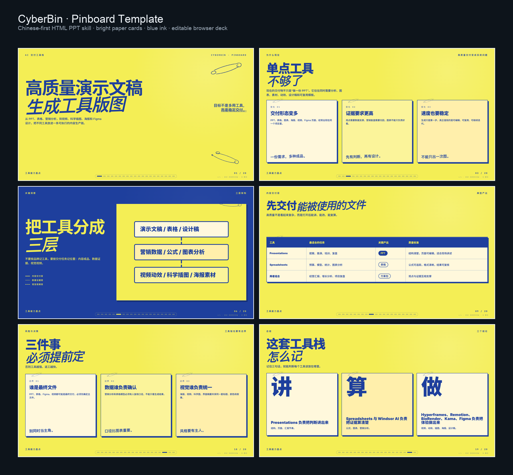

# CyberBin PPT Skill

CyberBin is a local HTML PPT skill for generating horizontal, browser-based slide decks. v1 includes one public template: `pinboard`.

The deck output is a single `index.html` file with horizontal navigation, keyboard/wheel/touch controls, ESC overview, and `B` static mode.
Generated decks also include a small top-right toolbar for editing text, saving an edited HTML copy, and exporting a PowerPoint file.



## Current Template

| ID | Best for | Style |
|---|---|---|
| `pinboard` | AI tools, SaaS products, growth reviews, course decks, startup pitches | bright yellow paper, deep blue ink, paper cards, mono labels, hand-drawn paperclip marks |

More templates may be added later. v1 intentionally exposes only `pinboard`.

## Install for Codex

```bash
mkdir -p ~/.codex/skills
git clone https://github.com/caikankan/cyberbin-ppt-skill.git ~/.codex/skills/cyberbin
```

Then ask Codex:

```text
Use CyberBin to make a 20-slide pinboard HTML deck about AI tools.
```

## Install for Claude Code

```bash
mkdir -p ~/.claude/skills
git clone https://github.com/caikankan/cyberbin-ppt-skill.git ~/.claude/skills/cyberbin
```

Then use Claude Code with:

```text
/cyberbin make a 20-slide pinboard HTML deck about AI tools
```

Natural language prompts also work when Claude Code detects the skill from `SKILL.md`.

## Manual Smoke Test

From the skill folder:

```bash
node scripts/create-deck.mjs pinboard ./demo-pinboard/ppt --title "Pinboard Demo" --demo --slides 5
node scripts/validate-deck.mjs ./demo-pinboard/ppt/index.html --expected-slides 5 --template pinboard
```

Open `./demo-pinboard/ppt/index.html` in a browser.

For a Chinese demo, use a Chinese title or pass `--language zh`:

```bash
node scripts/create-deck.mjs pinboard ./demo-pinboard-cn/ppt --title "AI 如何改变个人创作流程" --demo --slides 20 --language zh
```

## Usage Notes

- Default deck length is 20 slides unless another count is requested.
- Chinese briefs produce Chinese-first decks.
- Demo language is detected from the title; use `--language zh` or `--language en` to force it.
- Full Chinese requests also localize decorative metadata.
- Long Chinese level-1 titles in constrained `pin-detail` layouts use smaller Chinese-only sizing rules.
- English decks keep the original English-scale title sizing.
- The `Edit` button makes visible text editable in the browser.
- The `Save HTML` button downloads a new edited HTML file.
- The `PPTX` button shows the export command. PPTX export keeps the visual background and places main copy as editable PowerPoint text boxes.

## Export PowerPoint

Install dependencies once from the skill folder:

```bash
npm install
```

Then export any generated deck:

```bash
node scripts/export-pptx.mjs ./demo-pinboard-cn/ppt/index.html ./demo-pinboard-cn.pptx
```

The result is a `.pptx` file with editable main text. Decorative backgrounds and paperclip marks are kept as visual background.

## Contributing

This public repository is maintained by its owner. External users cannot directly change the main repository unless explicitly granted collaborator access.

If you want to customize CyberBin, fork the repository and change your own copy. Pull requests are welcome as suggestions, but merging is at the maintainer's discretion.

## Attribution and License

CyberBin derives its HTML PPT runtime approach from [Guizang PPT Skill](https://github.com/op7418/guizang-ppt-skill).

CyberBin is released under AGPL-3.0. See [LICENSE](./LICENSE) and [NOTICE](./NOTICE).
